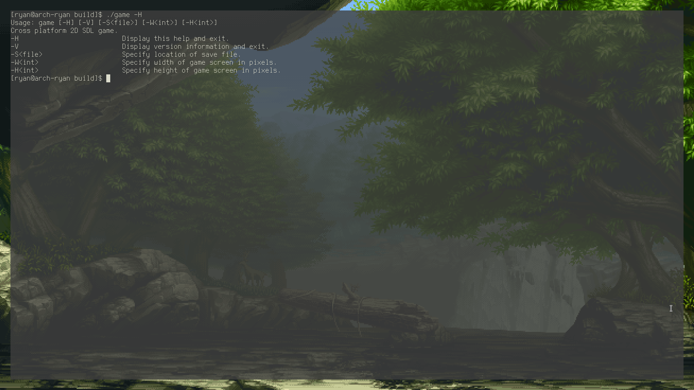

# game:


## Overview
game is a 2D cross platform SDL program.

It boasts:
* Cross platform
* Flexible command line argument handling 

## Versioning
Following version 1.0.0, game follows the [semantic](https://semver.org/) versioning scheme.

## Licensing
game is licensed under the MIT license. Check the [LICENSE.md file](LICENSE.md).
The documentation for game is licensed under the Creative Commons Attribution 4.0 International license. Check the [LICENSE-docs.md file](LICENSE-docs.md).

## Support
For generic questions about game you are encouraged to engage with the game community on [gitter](https://gitter.im/game)

## Documentation
The documentation for game is located in the `docs/` subdirectory. It uses the [Sphinx](http://sphinx-doc.org/)
framework, which makes it possible to build the documentation in multiple formats.

```bash
$ # navigate to the location of game's documentation:
$ cd docs/
$ # show supported documentation building options:
$ make help
$ # e.g build documentation as HTML:
$ make html
```

Documentation can also be browsed online [here](http://docs.libuv.org).]

## Downloading

### Prerequisites
#### Programs 

| Linux/Mac               | Windows |
| :---------------------: | :-----: |
| cmake (version >= 3.0.2) | cmake (version >= 3.0.2) |
| gcc (version >= 5.0) or clang (version >= 4.0) | visual studio (edition >= 2013) | 
| (if planning to write documentation) sphinx | sphinx |

#### Libraries

* SDL2 

### Verifying
All game release tags are signed with the developer's key.
The relevent GPG key(s) to import are listed in the [MAINTAINERS.md](MAINTAINERS.md) file.

```bash
$ # import gpg key:
$ gpg --keyserver pool.sks-keyservers.net --recv-keys <gpg-key>
$ # verify release tag:
$ git verify-tag <tag-name>
```
### Obtain 
```bash
$ # clone the repository:
$ git clone https://www.github.com/OutbackMan/tetris
$ # navigate to game project directory:
$ cd game/
$ # prepare to build: 
$ mkdir build && cd build/
$ # generate a build mode specific output
$ # supported build modes are 'Release', 'Debug' (default), 'MinSizeRel' and 'RelWithDebInfo'
$ # e.g, generate release mode makefile:
$ cmake -DCMAKE_BUILD_TYPE=Release ..
$ # generate binary
$ cmake --build .
$ # run test suite:
$ ctest .
$ # (Optional) Generate installer:
$ cpack .
$ # Run e.g, list game help options:
$ ./game -H # UNIX ENVIRONMENT
$ game.exe /H # WINDOWS ENVIRONMENT

```

## Contributing
To obtain the guidelines for contributing to game, please refer to the [contributing file](CONTRIBUTING.md).
